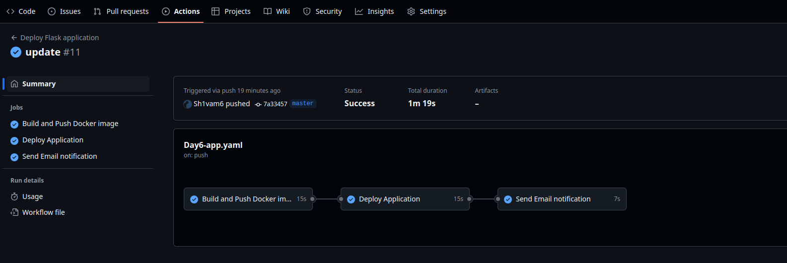
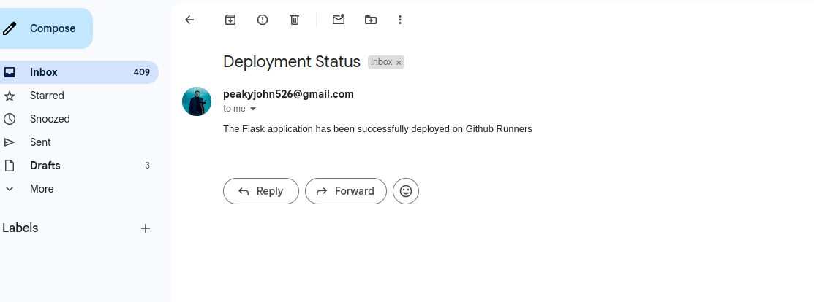

# Flask Application

This project is a simple Flask application that demonstrates how to set up a web server using Flask.

## Prerequisites

- Python 3.x
- pip (Python package installer)

## Setup Instructions

1. **Clone the repository:**

   ```bash
   git clone https://github.com/yourusername/flask-app.git
   cd flask-app
   ```

2. **Create a virtual environment (optional but recommended):**

   ```bash
   python -m venv venv
   source venv/bin/activate  # On Windows use `venv\Scripts\activate`
   ```

3. **Install dependencies:**

   ```bash
   pip install -r requirements.txt
   ```

## Running the Application

To run the application, execute the following command:

```bash
python app.py
```

The application will be accessible at `http://0.0.0.0:5000`.

# GitHub Actions vs Jenkins

## Key Differences

| Feature                    | GitHub Actions                                      | Jenkins                                               |
|----------------------------|-----------------------------------------------------|--------------------------------------------------------|
| **Hosting**                | Cloud-hosted by GitHub                             | Self-hosted (can also be run in the cloud)            |
| **Setup Complexity**       | Easy setup, minimal configuration                  | Requires manual setup and maintenance                 |
| **UI/UX**                  | Integrated into GitHub’s interface                 | Separate UI, more complex                             |
| **Plugins/Extensibility**  | Uses reusable Actions from GitHub Marketplace      | Extensive plugin ecosystem                            |
| **Integration**            | Deep GitHub integration                            | Can integrate with any system using plugins           |
| **Scalability**            | GitHub-hosted or self-hosted runners               | Scalable with custom infrastructure                   |
| **Cost**                   | Free for public repos; billed for private repos    | Free (open-source); infrastructure costs apply        |
| **Configuration Language** | YAML                                               | Groovy (Pipeline as Code) or web UI                   |

---

# Structure of a GitHub Actions Workflow

A GitHub Actions workflow is defined in a `.yml` file inside the `.github/workflows/` directory of your root repository.

```yaml
name: CI

on:
  push:
    branches: [ main ]
  pull_request:
    branches: [ main ]

jobs:
  build:
    runs-on: ubuntu-latest

    steps:
    - name: Checkout code
      uses: actions/checkout@v3

# Managing Variables and Secrets in GitHub Actions

GitHub Actions provides several ways to manage variables and secrets for your workflows. This guide covers the different types of variables, their scopes, and best practices for securing sensitive information.

## Types of Variables

### 1. GitHub Secrets

Secrets are encrypted environment variables that are stored at the repository, organization, or environment level. They're ideal for sensitive information like API keys, passwords, and tokens.

### 2. Variables

Variables are non-encrypted values that can be reused across multiple workflows. They're appropriate for non-sensitive configuration data.

### 3. Default Environment Variables

GitHub automatically provides certain environment variables in every workflow run (like `GITHUB_REPOSITORY`, `GITHUB_SHA`, etc).

## Scope and Hierarchy

Variables and secrets can be defined at different levels, with the following precedence (highest to lowest):

1. **Environment level** - Specific to deployment environments
2. **Repository level** - Available to all workflows in a repository
3. **Organization level** - Available to all repositories in an organization
4. **Default environment variables** - Provided by GitHub Actions

## Setting Up Secrets

### Repository Secrets

```yaml
# Access in workflow
jobs:
  example-job:
    runs-on: ubuntu-latest
    steps:
      - name: Use repository secret
        run: echo "API Key is ${{ secrets.API_KEY }}"
        # The actual value won't be printed in logs
```

To add repository secrets:
1. Navigate to your repository
2. Go to Settings > Secrets and variables > Actions
3. Click "New repository secret"
4. Enter the name and value


## Setting Up Variables

Variables are set up similarly to secrets but are stored unencrypted and visible in workflow logs.

### Repository Variables

```yaml
# Access in workflow
jobs:
  example-job:
    runs-on: ubuntu-latest
    steps:
      - name: Use repository variable
        run: echo "Node version is ${{ vars.NODE_VERSION }}"
```

To add repository variables:
1. Navigate to your repository
2. Go to Settings > Secrets and variables > Actions
3. Click the "Variables" tab
4. Click "New repository variable"






### Note:- For Email verification , First generate app password from your email account and then paste it to a secret , email password will not work
